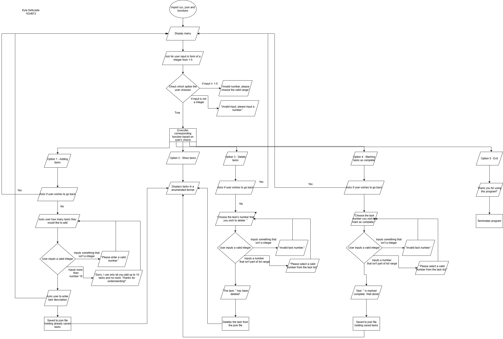

# WELCOME TO THE PROJECT REPORT #

## Project Overview ##

This program is designed to be a to-do list performed solely on a command-line interface (CLI) if ported as a .exe file OR within a terminal of a Integrated Development Environment (IDE) such as Visual Studio Code.

It's current purpose is to just store tasks and/or activities the user needs to complete, and present it to them in a ordered list format.

I created this program because I always use a to-do list myself in my day-to-day life and wish to discover how they are programmed.

It's current features include:\
    - Adding tasks to the to-do list\
    - Showing the total list of tasks, it's description and status\
    - Marking tasks as complete\
    - Deleting tasks, whether they're incomplete or complete\
    - Exiting the program

## Program Structure & Logic ##

    Programming language used: Python

### Main Components ###
1. **Main Menu**

Where the program begins, and the user is prompted to begin the main loop of the program

2. **Task Management**

*Task Storage:* Tasks are loaded from a JSON file and/or saved.\
*Task Operations:* Run from main functions file:
- Adding tasks
- Removing tasks
- Marking tasks as complete
- Deleting tasks
- Exiting program
 - Saving tasks to JSON file
- Loading tasks from JSON file to program
- Returning to Main menu 

3. **User interface**

*Input handling:* User commands, often in form of integers to progress through the program. Only strings are allowed for task descriptions.

*Output display:*  Through the showing tasks option (Option 2), which should show the current list of tasks to the user in a ordered and numbered list (Ascending-Descending).

4. **Data Persistence**

Importing the JSON module which ensures that tasks are saved after the adding tasks, deleting tasks, and marking tasks functions are executed each time.

Loading tasks from the JSON module always begins when the program is first booted up.

5. **Error Handling:**

*If-Else statements:*
 Used to redirect the user back to the original prompt (E.g the main menu or the option's input prompt) after telling them that their current input doesn't meet the right conditions.\
 E.g if they inputted the number 6 in the main menu despite only having 5 options, as shown in the flowchart, they get redirected\

 E.g If they inputted more than the number 10 in the adding tasks function, as shown in the flwochart, a message is displayed prompting them to change their answer and is redirected.

*Try-except statements:*
Used to redirect the user back to the original prompt but only if they inputted the incorrect value\
 E.g They inputted a string in the section that asks for how many tasks they wish to add or which task they wish to delete.
    
6. **Utility Functions**

*Going back to the Main Menu:*
If the user accidentally inputs the wrong option or they changed their mind, they are met with the option to return to the previous menu -- this is the only other time they are allowed to use strings.\
 e.g the go_back function
        
*Making strings case-insensitive:*
Just for user friendliness and to prevent potential program errors.\
e.g Used only in the go_back function to ensure that the function will still execute even if the user inputs a lowercase 'y', rather than a uppercase 'Y'.

*Checking if input is a string:*
To ensure the program only accepts strings in the go_back function, I made a check (.isalpha) before it can execute. I didn't add this for task descriptions because users might want to use numbers in their tasks.

## FUTURE EXTENSIONS ##

[ ] Add reminders to do tasks - push notifications\
[ ] Add priorities to each task\
[ ] Add end dates to each task\
[ ] Add Calendar section\
[ ] Add finance tracker section\
[ ] Add emojis (for fun)\
[ ] Ability to share tasks to others\
[ ] Add sound effects to buttons\
[ ] Add subtasks to the original tasks\
[ ] Add a GUI

## REFLECTION ##

This section will discuss the issues I've faced and how I approached solving each one.

**1. Function Calling via Console**\
*Challenge:* Initially struggled with calling functions through the console, specifically the main program.

*Solution:* Did research on how to call it from using a Python website Bryan Weber. (2025). Defining Main Functions in Python – Real Python. https://realpython.com/python-main-function/

**2. Improving User Interface**\
*Challenge:* Wanting to state which task was deleted when selected

*Solution:* Learned about list accessing and key-value pairs. Storing the action within a variable (e.g the deleted_task_display)

*Source:* w3Schools. (n.d.). Python—Access List Items. Retrieved 7 March 2025, from https://www.w3schools.com/python/python_lists_access.asp

**3.Error Handling for User Input**\
*Challenge:* Program crashed when non-integer input was provided for task selection.

*Solution:* Implemented try-except blocks to handle incorrect input types

*Source:* w3Schools. (n.d.). Python Try Except. Retrieved 7 March 2025, from https://www.w3schools.com/python/python_try_except.asp

**4. Code Organisation**\
*Challenge:* Main file became cluttered with multiple functions

*Solution:* Created separate function file for neater main file and better organisation of functions

**5. Syntax and Logic Errors**\
*Challenge:* Various issues including value errors, type errors, and infinite loops.

*Solution:* With help of Copilot AI, Perplexity AI, and Github Pilot; they reviewed and suggested adjustmented for code syntax, dictionary access methods, and restructured loop logic

*Source:* Microsoft. (2023). Copilot (2023 version) [Large language model]. https://www.microsoft.com/copilot\
Anthropic, 2023, Claude, [No specific version number available], Large Language Model, https://www.perplexity.ai/\
GitHub. (2023). GitHub Copilot. Version 1. Large Language Model. https://github.com/features/copilot

**6. Program Termination**\
*Challenge:* Unsure of how to properly exit the program, and even if I broke the while loop using break it was not clean and professional-looking as it was abrupt.

*Solution:* Researched about sys module for sys.exit() function 

*Source:* 
Python sys Module. (2023, November 18). GeeksforGeeks. https://www.geeksforgeeks.org/python-sys-module/

**7. File Handling Intergration.**\
*Challenge:* Issues with finding and loading data from JSON files

*Solution:* Utilised global keyword tasks so it can be affected by saving and loading functions. Specified full file paths and added print debug statements to check which code is being read and which is being not. 

*Source:* w3Schools. (n.d.). Python global Keyword. Retrieved 7 March 2025, from https://www.w3schools.com/python/ref_keyword_global.asp\

## Rationale for Design Decisions ##
<table>
    <tr>
    <th>Modular Structure<th>
        <td>Separating functions into different files improved code readability and maintainability.</td>
    </tr>
</table>
 
 

<table>
    <tr>
    <th>JSON for Data Storage</th>
        <td>I chose JSON over .txt file and .csv because JSON uses key-value pairs which my to-do list requires. Has good future-proofing if I wish to add more functionalities such as due dates and prorities, due to it's ability to store structured data. Also easier to format to read.</td>
        <td>.txt is too unorganised for my program's purpose, only suitable for simple lists and notes without any built-in data organisation. </td>
        <td> .csv is used for tabular and spreadsheet data which my to-do list does not need (If I decide to add a finance tracker, then perhaps.)</td>
    </tr>
</table>

 
 

<table>
    <tr>
    <th>Error Handling</th>
        <td> Implemented robust error handling to ensure smooth user experience and program stability</td>
    </tr>
</table>
 
 
<table>
    <tr>
    <th>Use of Dictionary and Lists</th>
        <td>Used dictionaries for tasks to easily manage multiple attributes (description, completion status) per task.</td>
        <td>Did not use sets because they don't allow duplicates and don't support key-value pairs.</td>
        <td>Used list to store all the values inputted; easily modified and allows duplicates.</td>
        <td>Did not use Tuples because it's fixed data and are immutable.</td>

